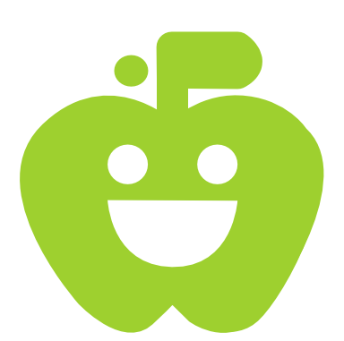
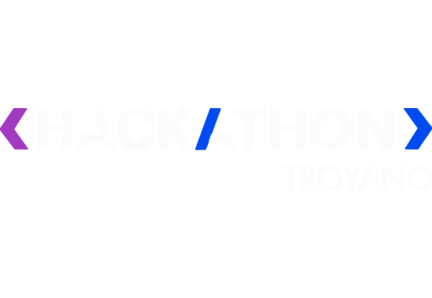

<div align="center">

  
  

### VisionFeast — Aplicación móvil inteligente de nutrición y bienestar

[](https://fastapi.tiangolo.com/)
[](https://www.python.org/)
[](https://www.mongodb.com/)
[](https://ai.google.dev/)
[](https://reactnative.dev/)

---

Bienvenido a VisionFeast, un proyecto creado para el Hackathon FIF 2026. Nuestra aplicación transforma la manera en que las personas gestionan su salud y bienestar utilizando Google Gemini AI y visión por computadora.

</div>

---

## Tabla de Contenidos

- [Objetivo](#objetivo)
- [Nuestra Solución](#nuestra-solución)
- [Instrucciones Paso a Paso](#instrucciones-paso-a-paso)
- [Estructura del Proyecto](#estructura-del-proyecto)
- [Roles de Usuario](#roles-de-usuario)
- [Recursos y Stack Tecnológico](#recursos-y-stack-tecnológico)

---

## Objetivo

Desarrollar una aplicación móvil revolucionaria que resuelva las limitaciones de los sistemas de nutrición actuales (registro manual tedioso, planes genéricos, falta de validación profesional), ofreciendo análisis visual automático, planes dinámicos y coaching personalizado con inteligencia artificial.

---

## Nuestra Solución

VisionFeast aborda la problemática actual con:

| CARACTERÍSTICA | DESCRIPCIÓN |
|---|---|
| Análisis visual automático | Toma una foto y obtén análisis nutricional instantáneo con detección de ingredientes. |
| Reconocimiento universal | Identifica platillos locales y calcula calorías y macronutrientes precisos. |
| Coaching personalizado | IA que aprende de tus patrones y sugiere mejoras basadas en tus objetivos. |
| Planes dinámicos | Menús semanales y rutinas de entrenamiento que se adaptan a tu progreso. |
| Generación de recetas | Crea recetas basadas en ingredientes disponibles, con información nutricional completa. |

> **Nota:** La integración nutrición-ejercicio en una sola plataforma cuenta además con validación profesional por nutriólogos certificados.

---

## Instrucciones Paso a Paso

### Paso 1 — Clonar el Repositorio

Abre tu terminal y clona el repositorio:

```bash
git clone https://github.com/dferram/VisionFeast.git
cd VisionFeast
```

### Paso 2 — Configurar el Backend

1. Navega a la carpeta del backend y crea un entorno virtual:
   ```bash
   cd backend
   python -m venv venv
   ```
2. Activa el entorno virtual:
   - En Windows (PowerShell): `.\venv\Scripts\activate`
   - En Mac/Linux: `source venv/bin/activate`
3. Instala las dependencias y ejecuta el servidor:
   ```bash
   pip install -r requirements.txt
   uvicorn main:app --reload
   ```

### Paso 3 — Configurar el Frontend (Móvil)

1. En una nueva terminal, navega a la carpeta móvil:
   ```bash
   cd mobile
   ```
2. Instala las dependencias y arranca el proyecto en Expo:
   ```bash
   npm install
   npm start
   ```

---

## Estructura del Proyecto

```text
VisionFeast/
|-- README.MD                 <- Este documento principal
|
|-- backend/                  <- API Backend (FastAPI)
|   |-- README.md             <- Instrucciones específicas del backend
|   |-- app/                  <- Código fuente, APIs y Modelos
|   |-- tests/                <- Suite de pruebas (pytest)
|
|-- mobile/                   <- Aplicación Móvil (React Native / Expo)
|   |-- README.md             <- Instrucciones específicas del frontend móvil
|   |-- app/                  <- Componentes y Pantallas (Screens)
|   |-- assets/               <- Recursos gráficos
|
|-- public/                   <- Archivos públicos y logotipos
    |-- Logo.png              <- Logo oficial de VisionFeast
    |-- logoHack.png          <- Logo del Hackathon FIF 2026
```

---

## Roles de Usuario

La plataforma maneja un sistema dual que beneficia a todos los involucrados:

### Para Usuarios
- Registro y seguimiento visual de comidas.
- Acceso a recetas y planes dinámicos personalizados.
- Seguimiento automático de progreso hacia metas de salud.

### Para Profesionales (Nutriólogos)
- Herramientas avanzadas de análisis profesional.
- Validación de planes generados por IA (asegurando el criterio médico).
- Seguimiento detallado de pacientes.

---

## Recursos y Stack Tecnológico

- **Backend:** FastAPI, Python 3.13+, MongoDB, Beanie ODM.
- **Frontend:** React Native, Expo, React Navigation.
- **Servicios Externos:** 
  - Google Gemini AI (gemini-1.5-flash) para visión y generación de contenido.
  - Google OAuth 2.0 para autenticación segura.
  - ElevenLabs para síntesis de voz (opcional).

> ¿Tienes dudas? Revisa la documentación en las carpetas `backend` y `mobile` o abre un **Issue** en el repositorio.
